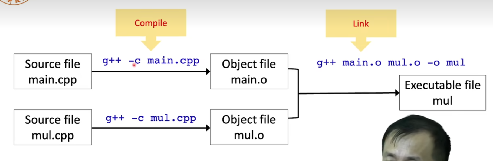

# Lecture 1.2 different programming languages
## assembly languages 
- are more human readable compared to binary instructions for CPU
## C 1969~1972
## C++ 1979
- as an extension of the programming language
- C with classes
- Now it is C++++++++++++
## java  1995
- i hate memory management in C/C++, java use automatic memory management  
- i want "write once, run anywhere", not "write once complie anywhere"  
- grammar is similar with C++  
- A java compiler generates *.class files, not executable files
## python 1990
- i hate strict grammar
- i hate too many data types
## scrach 2002
- i do not like to type a keyboard
## advantages of C/C++
- Development language of most fundemantal computer system
1. linux windows 操作系统
2. MySQL 数据库系统
3. OpenCV  计算机视觉库
4. backend of Tensorflow , PyTorch 深度学习的框架底层的模块还是C/C++
- high efficiency  高效率
1. widely optimized compilers  编译器好
2. access memory directly  直接访问内存
3. excellent on computing   
4. important language for AI algorithm implementation


# Lecture 1.3: Compile and link 
```C
#include <iostresm>
using namespace std;
int mul (int a, int b)
{
    return a * b
}
int main()
{
    int a, b;
    int result;
    cout << "Please input two integers:";
    cin >> a;
    cin >> b;

    result = mul(a,b);
    cout <<

}
```


先将源文件编译成.o 文件  之后再将 .o 文件链接成 可执行文件
## we have two types files  .cpp and .hpp
- mul.cpp have statements and body of functions
- mul.hpp only have statements of functions
- main.cpp have main functions

> steps to run a cpp program
```bash
compile
$ g++ -c main.cpp
$ g++ -c mul.cpp

link
$ g++ main.o mul.o -o mul
```


# Lecture 1.4: Preprocessor


# Lecture 1.5: Simple input and output


<!-- --------------- -->

## Format Text

*Italic emphasis* , _Alternative italic emphasis_

**Bold emphasis** , __Alternative bold emphasis__

~~Strikethrough~~

Break line (two spaces at end of line)  

> Block quote

`Inline code`

```
Code blocks
are
awesome
```

<!-- --------------- -->
 
## Lists
### Ordered & unordered

* Unordered list
* ...with asterisk/star
* Test

- Another unordered list
- ...with hyphen/minus
- Test

1. Ordered list
2. Test
3. Test
4. Test

- Nested lists
    * Unordered nested list
    * Test
    * Test
    * Test
- Ordered nested list
    1. Test
    2. Test
    3. Test
    4. Test
- Double-nested unordered list
    - Test
    - Unordered
        - Test a
        - Test b
    - Ordered
        1. Test 1
        2. Test 2

### Checklist
* [ ] Salad
* [x] Potatoes

1. [x] Clean
2. [ ] Cook

<!-- --------------- -->

## Links
[Link](https://duckduckgo.com/)

[File in same folder as the document.](markor-markdown-reference.md) Use %20 for spaces!

<!-- --------------- -->

## Tables

| Left aligned | Middle aligned | Right aligned |
| :--------------- | :------------------: | -----------------: |
| Test                 | Test                      | Test                    |
| Test                 | Test                      | Test                    |

÷÷÷÷

Shorter | Table | Syntax
:---: | ---: | :---
Test | Test | Test
Test | Test | Test

<!-- Comment: Not visibile in view. Can also span across multiple lines. End with:-->

<!-- --------------- -->

## Math (KaTeX)
See [reference](https://katex.org/docs/supported.html) & [examples](https://github.com/waylonflinn/markdown-it-katex/blob/master/README.md). Enable by checking Math at `Settings > Markdown`.

### Math inline

$ I = \frac V R $

### Math block

<div>
$$\begin{array}{c} \nabla \times \vec{\mathbf{B}} -\, \frac1c\, \frac{\partial\vec{\mathbf{E}}}{\partial t} & = \frac{4\pi}{c}\vec{\mathbf{j}} \nabla \cdot \vec{\mathbf{E}} & = 4 \pi \rho \\ \nabla \times \vec{\mathbf{E}}\, +\, \frac1c\, \frac{\partial\vec{\mathbf{B}}}{\partial t} & = \vec{\mathbf{0}} \\ \nabla \cdot \vec{\mathbf{B}} & = 0 \end{array}$$
</div>


$$\frac{k_t}{k_e} = \sqrt{2}$$

<!-- --------------- -->

## Format Text (continued)

### Text color

<span style='background-color:#ffcb2e;'>Text with background color / highlight</span>

<span style='color:#3333ff;'>Text foreground color</span>

<span style='text-shadow: 0px 0px 2px #FF0000;'>Text with colored outline</span> / <span style='text-shadow: 0px 0px 2px #0000FF; color: white'>Text with colored outline</span>


### Text sub & superscript

<u>Underline</u>

The <sub>Subway</sub> sandwich was <sup>super</sup>

Super special characters: ⁰ ¹ ² ³ ⁴ ⁵ ⁶ ⁷ ⁸ ⁹ ⁺ ⁻ ⁼ ⁽ ⁾ ⁿ ™ ® ℠

### Text positioning
<div markdown='1' align='right'>

text on the **right**

</div>

<div markdown='1' align='center'>

text in the **center**  
(one empy line above and below  
required for Markdown support OR markdown='1')

</div>

### Block Text

<div markdown='1' style='text-align: justify; text-justify: inter-word;'>
lorem ipsum dolor sit amet, consetetur sadipscing elitr, sed diam nonumy eirmod tempor invidunt ut labore et dolore magna aliquyam erat, sed diam voluptua. At vero eos et accusam et justo duo dolores et ea rebum. 
</div>

### Dropdown

<details markdown='1'><summary>Click to Expand/Collapse</summary>

Expanded content. Shows up and keeps visible when clicking expand. Hide again by clicking the dropdown button again.

</details>


<!-- --------------- -->

## Multimedia

### Images


### Videos
**Youtube** [Welcome to Upper Austria](https://www.youtube.com/watch?v=RJREFH7Lmm8)
<iframe width='360' height='200' src='https://www.youtube.com/embed/RJREFH7Lmm8'> </iframe>

**Peertube** [Road in the wood](https://open.tube/videos/watch/8116312a-dbbd-43a3-9260-9ea6367c72fc)
<div><video controls><source src='https://peertube.mastodon.host/download/videos/8116312a-dbbd-43a3-9260-9ea6367c72fc-480.mp4' </source></video></div>

<!-- **Local video** <div><video controls><source src='voice-parrot.mp4' </source></video></div> -->

### Audio & Music
**Web audio** [Guifrog - Xia Yu](https://www.freemusicarchive.org/music/Guifrog/Xia_Yu)
<audio controls src='https://files.freemusicarchive.org/storage-freemusicarchive-org/music/ccCommunity/Guifrog/Xia_Yu/Guifrog_-_Xia_Yu.mp3'></audio>

**Local audio** Yellowcard - Lights up in the sky
<audio controls src='../Music/mp3/Yellowcard/[2007]%20Paper%20Walls/Yellowcard%20-%2005%20-%20Light%20Up%20the%20Sky.mp3'></audio>

------------------

This Markdown reference file was created for the [Markor](https://gsantner.net/project/markor?source=markdownref) project by [Gregor Santner](https://gsantner.net) and is licensed [Creative Commons Zero 1.0](https://creativecommons.org/publicdomain/zero/1.0/legalcode) (public domain). File revision 2.

------------------