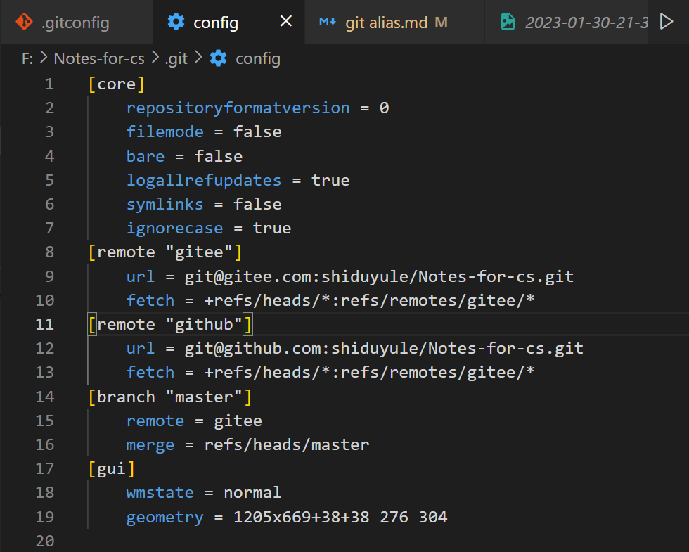
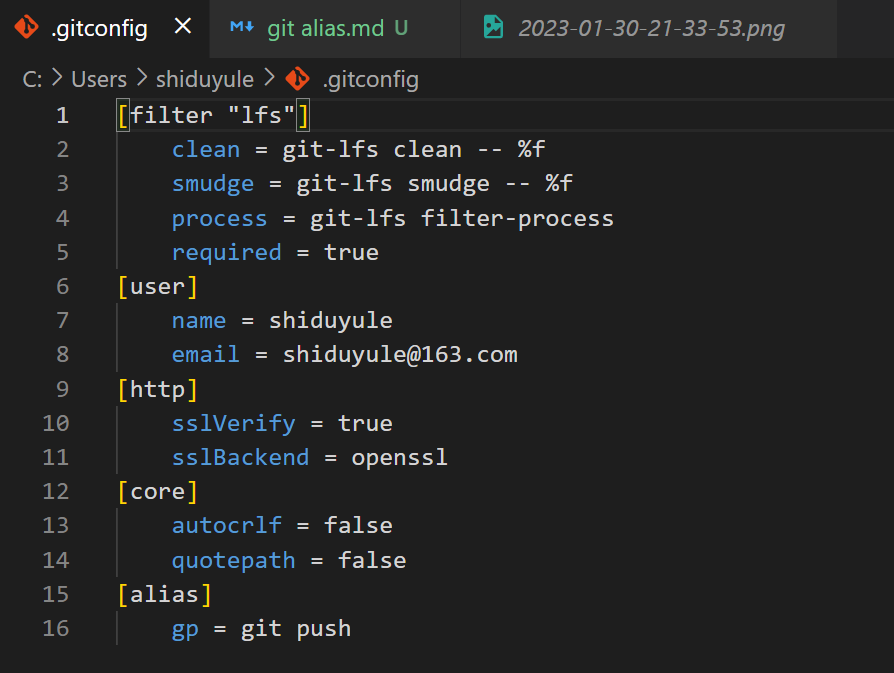

## git alias  设置缩写的别名

正常显示中文
```bash
git config --global core.quotepath false
```
### 1. （推荐） 在 git bash 中 直接使用 alias  


```bash
alias -p 查看 所有 别名设置

vim ~/.bash_profile
输入
alias gs='git status'
alias ga='git add .'
alias gc='git commit -m'
alias gp='git push'
alias gpt='git push gitee; git push github'

source ~/.bash_profile  相当于刷新一下 似乎重启一下也可以   
使用这个指令 用于重新加载 bash 配置 当你修改了 .bash_profile 文件后，无需重启终端即可立即生效
```
#### 增加第二个远端：
```bash
ls -a
code .git/config
增加 remote github
```



### 2. 在 gitconfig 中 增加别名
   # 这种别名只适用于git 指令内部
```bash
cd ~  进入用户目录
code  ~/.gitconifig   修改git 的配置文件

增加 alias
```



