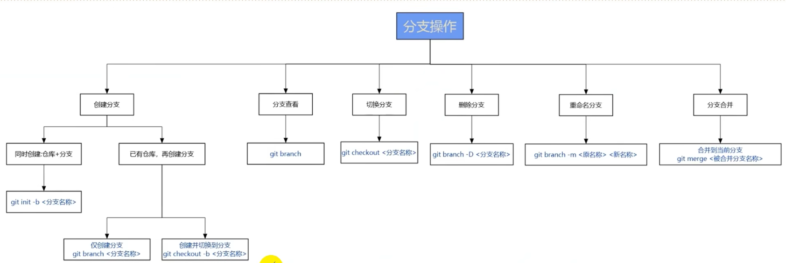

# 分支管理





1. 查看 增加 删除 改动（切换）
```shell
$ git branch -a   

查看所有分支，包括远程分支,*表示当前分支，红色表示远程分支

$ git branch temp    创建一个temp分支 
  git fetch origin master:temp 从origin获取master并新建temp存储它 
$ git branch -d <name>
  git branch -D <name> //强制删除
  git push origin :<name> 删除远程分支需要用push 

$ git checkout + <分支名> 切换分支
  git checkout -b <分支名> 创建一个新分支，并切换到它
```
2. 合并 (需谨慎)
```shell
$ git merge <branch name>
```
