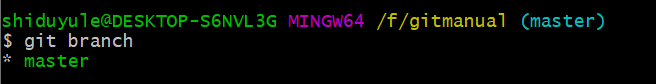
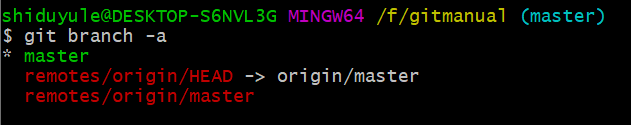
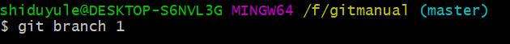

# 分支管理

## 查看分支
```bash
git branch
```
查看所有**本地分支**


---
```bash
$ git branch -a 
```
查看**所有分支**，包括远程分支,*表示当前分支，红色表示远程分支


remotes/origin 表示的是远程仓库 origin，这个 origin 是仓库名字。**就是说现在 该远程仓库的指针HEAD（git 使用了这个 HEAD 指针来指向你当前工作的分支 也就是 master）**。 本地仓库也是这样的：你当前工作在哪个分支上，HEAD 就指向那个分支。

## 增删分支
---
```bash
$ git branch 新分支名 
```
创建一个分支，但此命令并不会自动检出新创建的分支


```bash
$ git branch -d/-D  分支名
```
删除/强制删除分支

---

## 改动分支
```bash
git branch -m 新名字
```
重命名**当前分支**

