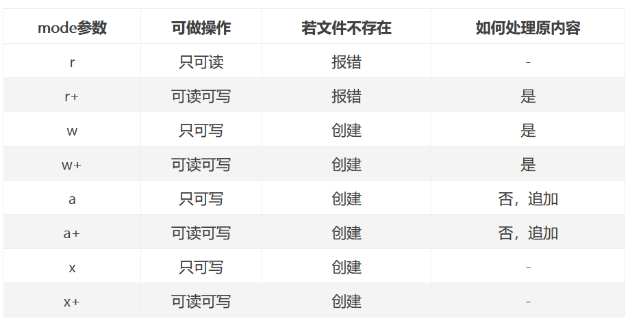

```python
my_file = open(file, mode, buffering, encoding, errors, newline, closefd, opener)  # 打开文件
...  # 读写操作。省略

my_file.colse()  # 释放文件


open函数必须搭配.close()方法使用，先用open打开文件，然后进行读写操作，最后用.close()释放文件。open函数有八个参数，如下。

```

file：文件路径或文件描述符。如为文件路径则是str类型，如是文件描述符，则是一个非负整数。文件描述符使用较少，通常情况下都传入文件路径。file参数和closefd参数有关，closefd为True则file既可以传入文件路径，又可以传入文件描述符。closefd为False，则file只能传入文件描述符。这里的文件描述符应拓展理解为Unix、Linux系统的文件描述符和Windows系统的句柄。可以简单理解为，在Unix、Linux系统下叫文件描述符，在Windows系统下叫句柄。打开或新建文件时，操作系统内核会返回一个非负整数，可以用来访问指定文件，这个非负整数就是文件描述符。在Python中可以使用os模块的open函数获取其文件描述符。下面是一个例子。


mode：操作模式，可选，str类型，默认为r。可选值包括r、r+、w、w+、a、a+、x、x+、rb、wb、ab、xb、rt、at、wt、xt这16种。乍一看比较乱，其实很好理解。基本操作模式有四种，r、w、a、x，分别代表读、写、追加、创建新文件

r模式下只能对文件进行读取操作，不能写入。指定文件若不存在，会报错。w模式下只能对文件进行写入操作，不能读取。指定文件存在，则直接打开写入。若不存在，则先创建文件，再写入。a模式下同样只能对文件进行写入操作，不能读取。指定文件存在，则直接打开写入。若不存在，则先创建文件，再写入。

a模式和w模式的区别在于，w模式写入时会先将文件原内容清空，再写入新内容。a模式不会清空文件原内容，而是把新内容追加在原内容之后。

x模式是新建一个文件，然后只能对其进行写入操作，不能读取。x模式下，指定文件必须不存在，若已存在，则会报错。

r、w、a、x是基本的操作模式，mode参数不管指定为什么，必定是基于这四种操作模式之一。这句话怎么理解呢？刚才说了，mode参数可选，只能是上面那16种之一，可以看下，那16种值是不是都包含了r、w、a、x之一。例如rt、r+，实际都是基于r模式的变种，与单纯的r模式相比有一些功能上的改变。w、a、x也是同理。

可以看到，如果是变种，第二个字符也不是随便取的，只能是t或b或+。先说t和b。t和b控制Python读写内容的方式，是相对应的。t代表以文本方式读写，读写时以字符为单位，只能用于读写文本类型的文件，比如.txt、.log、.csv等能直接用文本编辑器打开的文件类型。b代表以二进制方式读写，读写时以字节为单位，可以用于读写所有类型的文件。这里注意一下，若使用t方式，则必须将encoding参数指定为除None以外的值。若使用b方式，则必须将encoding参数指定为None。t和b只用于控制读写方式，必须依附于r、w、a、x四种基本模式使用。即不能将mode参数指定为t或b，但可以是rt、wt、at、xt、rb、wb、ab、xb。因为open函数读写默认采用t方式，所以如果省略不写，则默认为t。即rt、wt、at、xt等价于r、w、a、x。

所以，mode参数省略不写、指定为r、指定为rt，实际是一回事，没有区别。

 


t: 文本类型 (默认是rt 即只读文本 txt log csv)
b: 二进制类型


encoding：打开文件所用的编码，可选，str类型，默认为None。encoding参数仅可在采用文本方式（即mode值带t）读写数据的情况下有效，二进制方式下不可指定。文本编码有很多，常用的有utf-8、ascii、gbk等。mode参数采用文本方式的情况下，若encoding指定为None，则编码为locale.getpreferredencoding(False)这行代码的返回值。在Windows下，这行代码一般返回值为cp936,。cp936指的就是gbk


