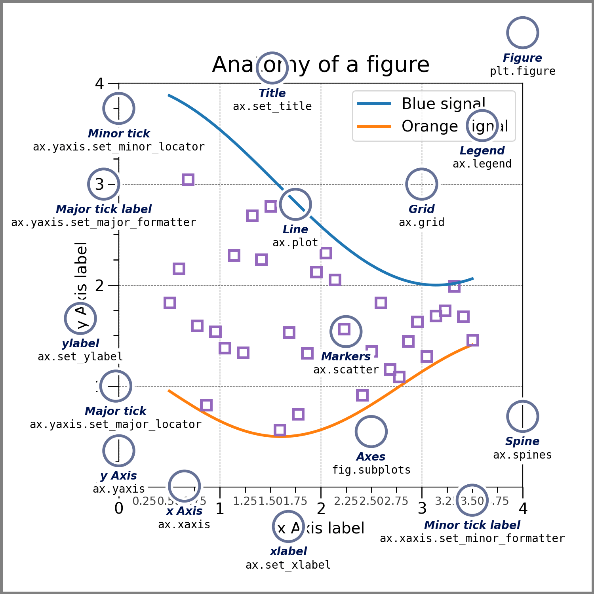

```python
# matplotlib 导入
import matplotlib.pyplot as plt
import numpy as np
```
matplotlib.org/stable/tutorials/index



## 基本使用
```python 
1. 单画布 单图
import matplotlib.pyplot as plt
import numpy as np
x = np.linspace(-1,1,50)
y = 2*x + 1
plt.plot(x,y)
plt.show()

2. 双画布  一布一图
y1 = 2*x + 1
y2 = x**2
plt.figure()
plt.plot(x,y1)

plt.figure()
plt.plot(x,y2)
plt.show()

3. 双画布  一布一图  多线条  设置颜色 线宽 线形
y1 = 2*x + 1
y2 = x**2
plt.figure(num = 3,figsize = (8,5))
plt.plot(x,y1)

plt.figure(num = 4,figsize= (8,5))
plt.plot(x,y1)
plt.plot(x,y2,color = 'red',linewidth = 1.0, linestyle = '--')
plt.show()
```
## 坐标轴 图例
```python
1. 坐标轴限定范围
plt.xlim((-1,2))
plt.ylim((-1,2))

2.坐标轴换单位
new_ticks1 = np.linspace(0,809,10)
new_ticksx = np.linspace(0,4.4,10)
new_ticksy = np.linspace(0,4.2,10)
new_ticksx = np.round(new_ticksx,2)
new_ticksy = np.round(new_ticksy,2)
plt.xticks(new_ticks1,new_ticksx)
plt.yticks(new_ticks1,new_ticksy) 

3. 坐标轴换成字符串
plt.yticks([-2,-1,0,1,2],r'$really\bad') 


2. 坐标轴添加标签
plt.xlabel('this is x')
plt.ylabel('this is y')

new_ticks = np.linspace()

```


## 画布的设定
```python
# 输入可以是实际的 RGB(A) 数据，也可以是 2D 标量数据
plt.figure()
matpltlib.pyplot.figure(
num = None,               
# 设定figure名称。系统默认按数字升序命名的figure_num（透视表输出窗口）e.g. “figure1”。可自行设定figure名称，名称或是INT，或是str类型；

figsize=None,             
# 设定figure尺寸。系统默认命令是rcParams["figure.fig.size"] = [6.4, 4.8]，即figure长宽为6.4 * 4.8；

dpi=None,                 
# 设定figure像素密度。系统默命令是rcParams["sigure.dpi"] = 100；

facecolor=None,           
# 设定figure背景色。系统默认命令是rcParams["figure.facecolor"] = 'w'，即白色white;可使用十六进制;

edgecolor=None, frameon=True,    
# 设定要不要绘制轮廓&轮廓颜色。系统默认绘制轮廓，轮廓染色rcParams["figure.edgecolor"]='w',即白色white；

FigureClass=<class 'matplotlib.figure.Figure'>,   
# 设定使不使用一个figure模板。系统默认不使用；

clear=False,                     
# 设定当同名figure存在时，是否替换它。系统默认False，即不替换。
**kwargs)
```
## 热图的设定

### 面向对象的语法
```python
fig,axes = plt.subplots(2,1,figsize = (6,6))
axes[0].bar()
```