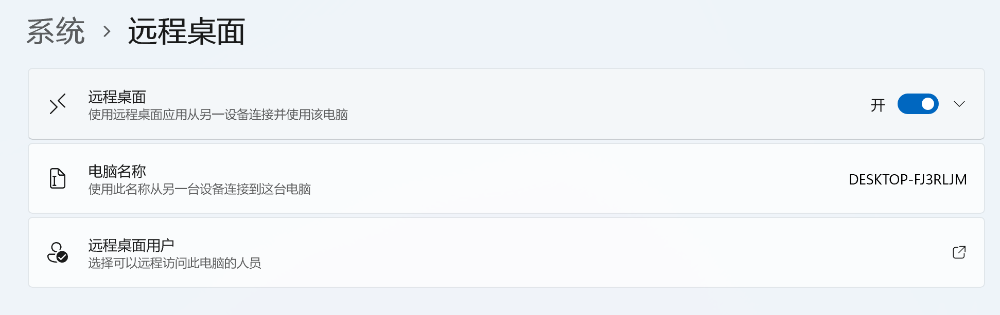
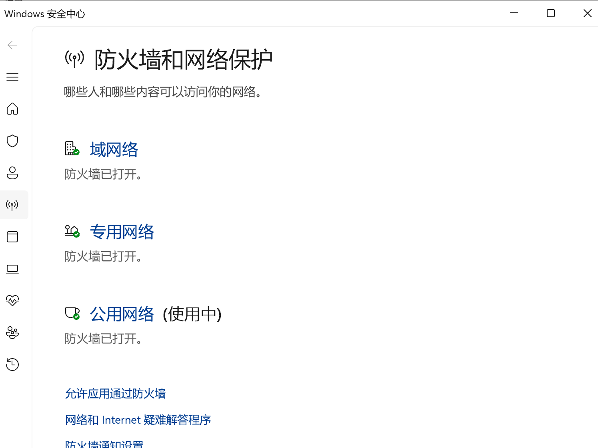
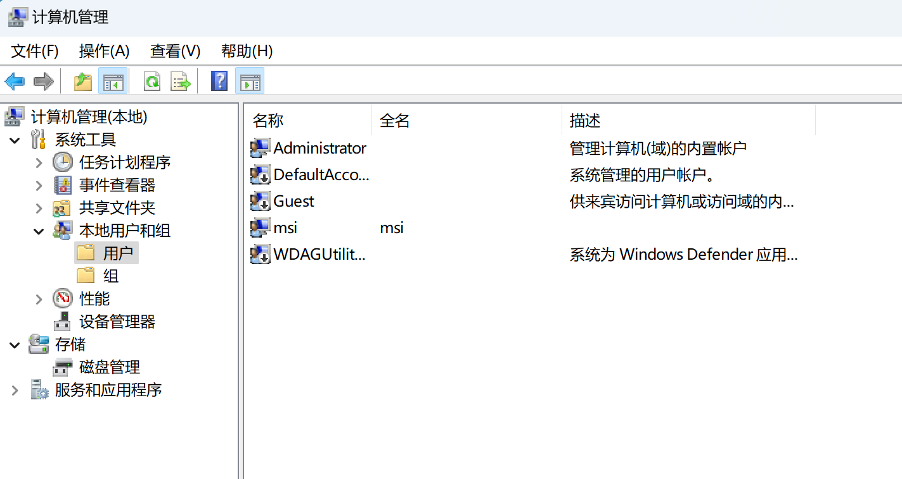
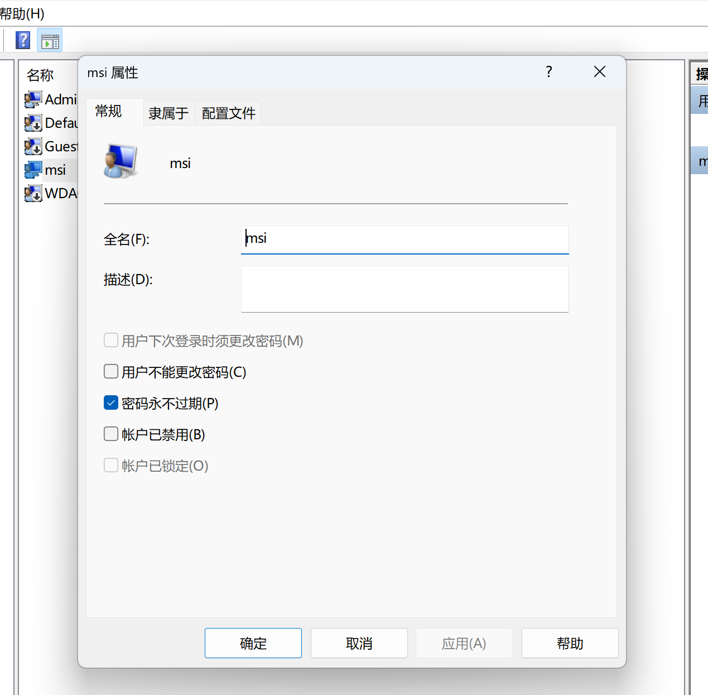

## 局域网内部使用win

## 被控端
1. 升级win 至专业版或企业版
software.bnu.edu.cn
2.  在系统中打开远程桌面

   

3. 隐私与安全性 - Windows安全中心 - 防火墙与网络保护 -  允许应用通过防火墙中-远程控制等等都选择上

**4. 在计算机管理中的本地用户和组中**

右键msi   属性---->账户已禁用打开
右键msi   设置密码  ---->  设置一个简短的密码

5. 打开任务管理器 查看IPV4 地址

## 控制端

1. 直接搜索栏输入远程桌面连接----- 输入刚才在被控端查询的IPV4

2. 输入 刚才的用户名msi 和刚设置的密码

### 连接成功

### 注意：不要使用administrator  会重新进入桌面
