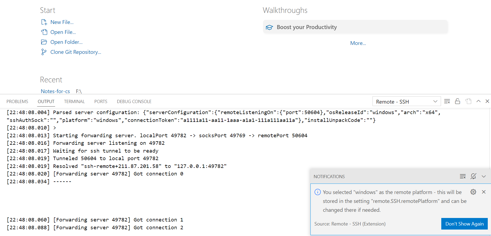

# 一. 远程主机为windows系统的情况
# ps: windows 系统永不休眠方法
```bash
打开管理员模式下的 powershell
$ powercfg -h off
```

### 1.1 下载openssh
>win 键- 添加可选功能
>搜索openssh 下载 服务器和客户端两个版本的openssh
>到命令行中输入 ssh -V 查看是否下载成功

### 1.2 启动ssh
>计算机管理-左侧服务中-OpenSSH Authentication Agent 和 OpenSSH SSH  server 右键启动一下 之后双击进去 把启动类型改为自动

### 1.3 进入powershell  看是否启动 ssh服务器是否开始监听 查看IP地址
```bash
$ Get-Service -Name *ssh* 
```


```bash
$ netstat -an | findstr :22
```


```bash
$ ipconfig 
```


记下这个ipv4 地址 用于ssh的连接

### 1.4 在其他终端上登陆
```bash
$ ssh "微软ID"@ipconfig得到的ipv4的地址
```



## 二. 免密登陆 - 配置公钥并上传

#### 2.1 在本地生产公钥
```bash
$ ssh-keygen
```

#### 2.2 使用命令一步之内上传到服务器 (适用于linux服务器 win不行)
```bash
$ ssh-copy-id -i ~/.ssh/id_rsa_for_winserver.pub "2716074465@qq.com"@211.87.201.58
```

#### 2.3 到服务器端
```bash
$ cd ~/.ssh 
$ cat >authorized.keys
将本地公钥的内容复制到其中
```
```bash
$ cd c:/programdata/ssh
$ cat sshd_config
```
**将34，38，51行反注释 将最后两行注释**

#### 2.4 到服务器端桌面
将计算机管理中的OpenSSH SSH Sever 服务重新启动
再连接就可以了

