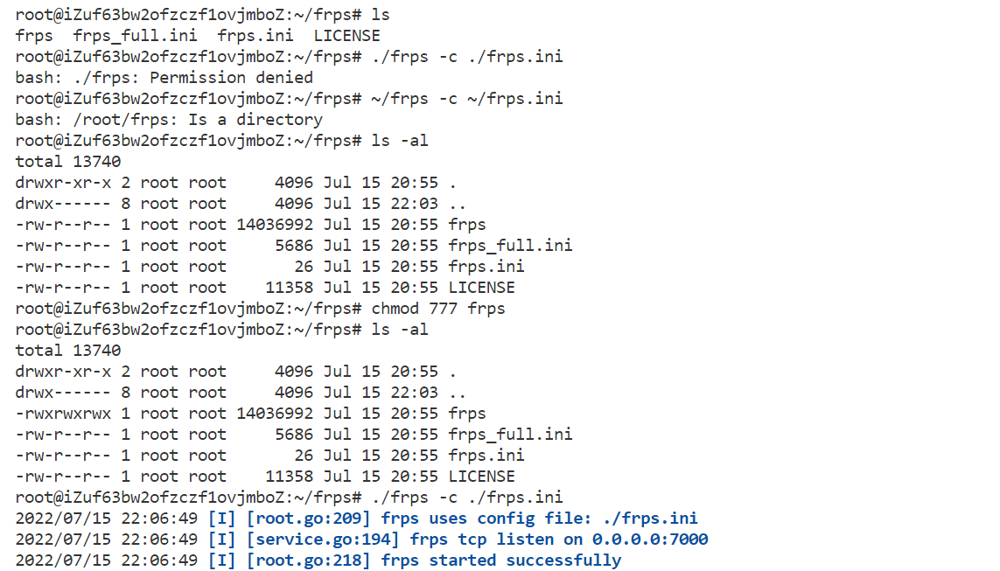
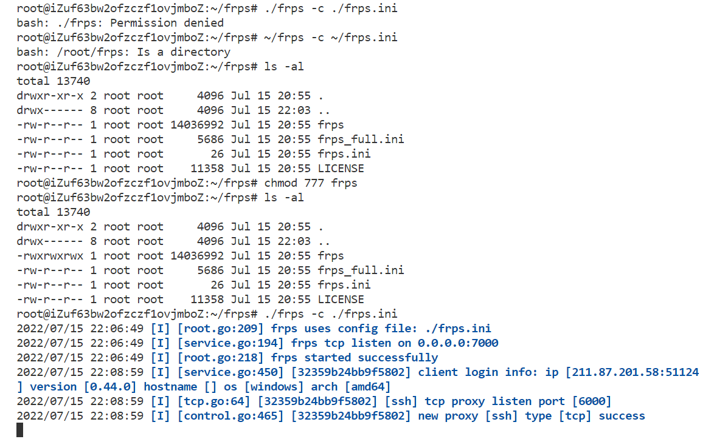

## 一. 在阿里云上租一个ECS云服务器获得一个公网ip 
>1. 购买后需要修改密码 然后重启实例
>2. 使用workbench可以实现远程登录 

校园网内ssh远程登陆 存在问题


## 二. 使用 frp 做端口映射
### 2.1 配置域名映射

在hosts文件最后加上 云服务器公网ip + 对应的域名（其实就是代号）
```bash
# Debian server
47.101.47.243 debian
```
### 2.2 配置 frp 用于启动端口映射
>在github上 下载frp windows 和 linux AMD 64 版本
https://github.com/fatedier/frp/releases 

> 将frps frps.ini frps_full.ini 三个文件加上license上传到云服务器-服务端

> 将frpc frpc.ini frpc_full.ini 三个文件加上license上传到windows端- 客户端
ps:修改一下frpc上的server_addr 将它换成你的云服务器公网ip


>在阿里云服务器上的安全组 添加两个端口


### 2.3 到云端手动启动 frps 和 frpc
> 到linux云端 启动frps
```bash
$ chmod 777 frps
$ ./frps -c ./frps.ini
```



> 到windows端 启动frpc  

**这里出现问题 云服务器的ip 被山大校园网路由给墙掉了**

```bash
$ .\frpc -c frpc.ini
```


>回来linux 端又多了三行




### 2.4 连接 一次成功
```bash
$ ssh -p 6000 "2716074465@qq.com"@47.101.47.243
```

## 三. frp 自启动
暂缺