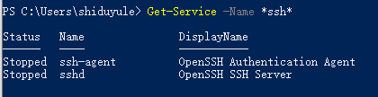
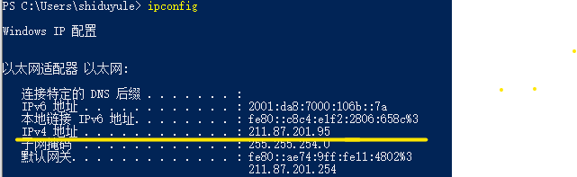

## 远程主机为windows系统的情况
### 1.下载openssh
>win 键- 添加可选功能
>搜索openssh 下载 服务器和客户端两个版本的openssh
>到命令行中输入 ssh -V 查看是否下载成功

### 2. 启动ssh
>计算机管理-左侧服务中-OpenSSH Authentication Agent 和 OpenSSH SSH  server 右键启动一下 之后双击进去 把启动类型改为自动

### 2.进入powershell  看是否启动 ssh服务器是否开始监听 查看IP地址
```bash
$ Get-Service -Name *ssh* 
```



```bash
$ netstat -an | findstr :22
```


```bash
$ ipconfig 
```


记下这个ipv4 地址 用于ssh的连接

### 3.在其他终端上登陆
```bash
$ ssh "微软ID"@ipconfig得到的ipv4的地址
```
