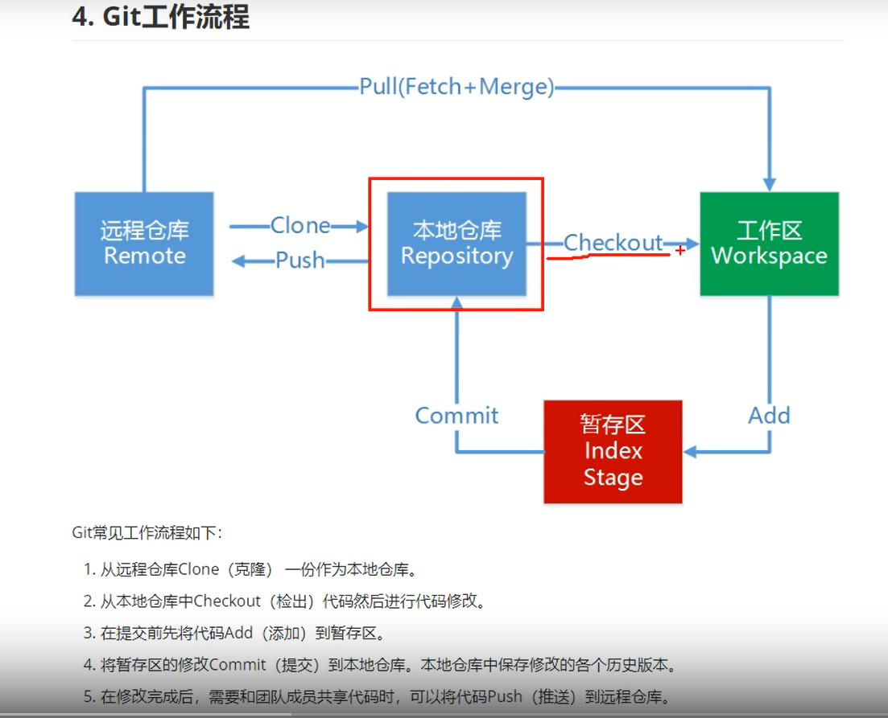
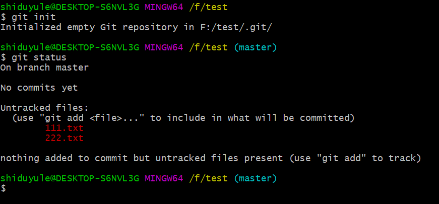
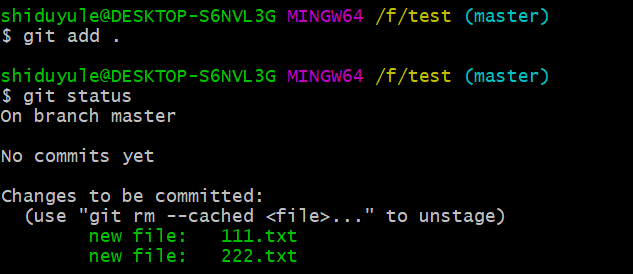
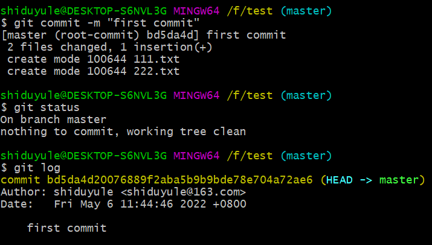
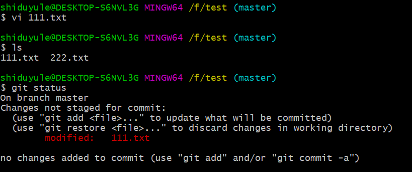

 

## 获取git仓库
通常两种获取 Git 项目仓库的方式：
    1. 将尚未进行版本控制的**本地目录**转换为**Git仓库**；
    2. 从其他**服务器**克隆一个已存在的**Git仓库**。
两种方式都会在你的本地机器上得到一个工作就绪的Git仓库。

## 1.初始化 加到暂存 提交到仓库

如果你有一个尚未进行版本控制的项目目录，想要用 Git 来控制它，那么首先需要进入该项目目录中：

之后执行
```bash
$ git init   启动仓库
$ git status 查看状态  两个文件都没有被追踪
```
 


```bash
$ git add .  将 所有文件 加入暂存区
$ git status  并查看状态 所有文件变绿了(被追踪了)
```


```bash
$ git commit -m "first commit"  m 代表 message
$ git status
$ git log 查看日志 什么人 什么时间 提交变更的message
还能看到这个提交的哈希值
```


## 2.修改文件 再加入暂存 再次提交到仓库
___
___
接下来修改文件111.txt
再次 使用 git status 查看状态



___


```text
当你变更了文件时，你需要使用git add 将文件变绿
再使用git commit 提交这一次的变更到仓库
```

___
___
## 3.版本回退
```bash
$ git reset + 哈希值 --hard
```


## 4.分支管理
在一个分支中的commit 都会
试一试 是否推送到gitee


---
## 使用 git bash 命令行 建立和管理仓库
>必须 在gitee 上**先有一个仓库** 临时建的 或者之前的都可以

### 方法一 ：
**在桌面上**```git clone https链接``` 直接得到的直接就是 一个仓库 + 增加删内容 + ```git add .``` + ```git commit -m ""``` + ```git push origin master``` 


### 方法二：  
1.cd项目，执行```git init```，初始化本地仓库

2.给本地仓库关联远程仓库

```git remote add origin https://gitee.com/shiduyule/仓库名.git```


3.先更新本地仓库

```git pull origin master```


4.推送本地仓库代码到远程仓库
```bash
git add .
git commit -m "第一次提交"
git push origin master
```