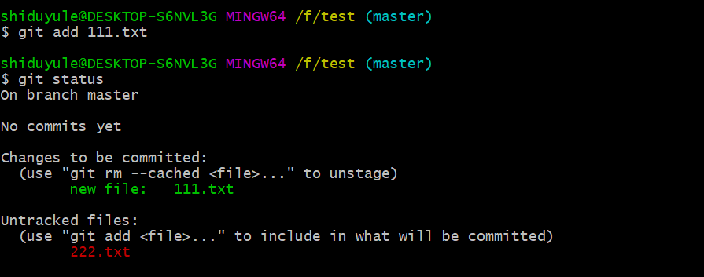

> git add .添加所有文件、文件夹和子文件夹，包括.gitignore和以点开头的任何其他内容；

> git add *将添加除以点开头的文件、文件夹和子文件夹以外的任何文件、文件夹和子文件夹。


add *表示添加当前目录中的所有文件，名称以点开头的文件除外。这是您的shell功能，Git只接收文件列表。

add .在shell中没有特殊的含义，因此git递归地添加整个目录，几乎相同，但包括名称以点开头的文件。
 

## 获取git仓库
通常两种获取 Git 项目仓库的方式：
    1. 将尚未进行版本控制的**本地目录**转换为**Git仓库**；
    2. 从其他**服务器**克隆一个已存在的**Git仓库**。
两种方式都会在你的本地机器上得到一个工作就绪的Git仓库。

### 在已存在目录中初始化仓库

如果你有一个尚未进行版本控制的项目目录，想要用 Git 来控制它，那么首先需要进入该项目目录中。 如果你还没这样做过，那么不同系统上的做法有些不同：


在 Linux 上：

> $ cd /home/user/my_project

在 macOS 上：

> cd /Users/user/my_project

在 Windows 上：

> cd /c/user/my_project

之后执行
```bash
$ git init   启动仓库
$ git status 查看状态  两个文件都没有被追踪
```
 


```bash
$ git add 111.txt  将 111.txt 加入暂存区
$ git status       并查看状态   一个文件变绿了(被追踪了)
```

<!--  -->

```bash
$ git add .  将 所有文件 加入暂存区
$ git status  并查看状态 所有文件变绿了(被追踪了)
```


```bash
$ git commit -m "first commit"  m 代表 message
$ git status
$ git log 查看日志
```


