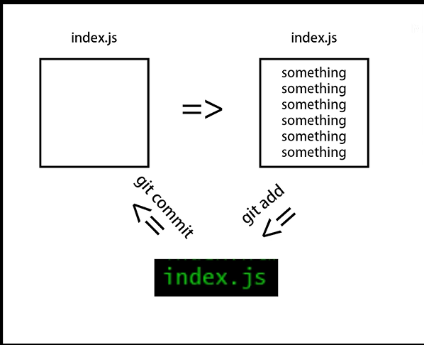

 

# 一.获取git仓库
通常两种获取 Git 项目仓库的方式：
    1. 将尚未进行版本控制的**本地目录**转换为**Git仓库**；
    2. 从其他**服务器**克隆一个已存在的**Git仓库**。
两种方式都会在你的本地机器上得到一个工作就绪的Git仓库。

## 1.初始化 加到暂存 提交到仓库

如果你有一个尚未进行版本控制的项目目录，想要用 Git 来控制它，那么首先需要进入该项目目录中：

之后执行
```bash
$ git init   启动仓库
$ git status 查看状态  两个文件都没有被追踪
```
 


```bash
$ git add .  将 所有文件 加入暂存区
$ git status  并查看状态 所有文件变绿了(被追踪了)
```


```bash
$ git commit -m "first commit"  m 代表 message
$ git status
$ git log 查看日志 什么人 什么时间 提交变更的message
还能看到这个提交的哈希值
```


## 2.修改文件 再加入暂存 再次提交到仓库
___
___
接下来修改文件111.txt
再次 使用 git status 查看状态


___


```text
当你变更了文件时，你需要使用git add 将文件变绿
再使用git commit 提交这一次的变更到仓库
```

___
___
## 3.版本回退
```bash
$ git reset + 哈希值 --hard
```


## 4.分支管理
在一个分支中的commit 都会
试一试 是否推送到gitee


---
# 二. 使用 git bash 命令行 建立和管理仓库
>必须 在gitee 上**先有一个仓库** 临时建的 或者之前的都可以

## 方法一(推荐) ：
**在桌面上**```git clone https链接``` 直接得到的直接就是 一个仓库 + 增加删内容 + ```git add .``` + ```git commit -m ""``` + ```git push origin master``` 


## 方法二(容易发生冲突)：  
1.cd项目，执行```git init```，初始化本地仓库

2.给本地仓库关联远程仓库

```git remote add origin https://gitee.com/shiduyule/仓库名.git```


3.先更新本地仓库

```git pull origin master```


4.推送本地仓库代码到远程仓库
```bash
$ git add .
$ git commit -m "第一次提交"
$ git push origin master
```

# 三. git 命令细节
## 1.git fetch 和 git pull 区别
Git中从远程的分支获取最新的版本到本地有这样2个命令：
1. git fetch：相当于是从远程获取最新版本到本地，不会自动merge(合并)
```bash
$ git fetch origin master 
它的意思是从名为 origin 的远程上拉取名为 master 的分支到本地分支origin/master 中。既然是拉取代码，当然需要同时指定远程名与分支名，所以分开写
$ git log -p master..origin/master
$ git merge origin/master
它的意思是合并名为 origin/master的分支到当前所在分支。既然是分支的合并，当然就与远程名没有直接的关系，所以没有出现远程名。需要指定的是被合并的分支。
```
以上命令的含义：
>1.首先从远程的origin的master主分支下载最新的版本到origin/master分支上
2.然后比较本地的master分支和origin/master分支的差别
3.最后进行合并

上述过程其实可以用以下更清晰的方式来进行：
```bash
$ git fetch origin master:tmp 
[在本地新建一个temp分支，并将远程origin仓库的master分支代码下载到本地temp分支]
$ git diff tmp 
来比较本地代码与刚刚从远程下载下来的代码的区别
$ git merge tmp
[合并temp分支到本地的master分支]
$ git branch -d temp 
[如果不想保留temp分支 可以用这步删除]
```
>从远程获取最新的版本到本地的test分支上
之后再进行比较合并

```bash
$ git pull origin master
```

上述命令其实相当于git fetch 和 git merge
在实际使用中，git fetch更安全一些
因为在merge前，我们可以查看更新情况，然后再决定是否合并。


## 2.git log 
```bash
$ git log 显示提交日志
$ git reflog 显示提交日志